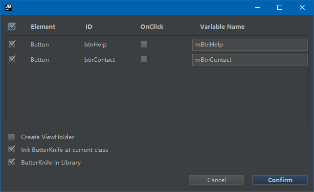
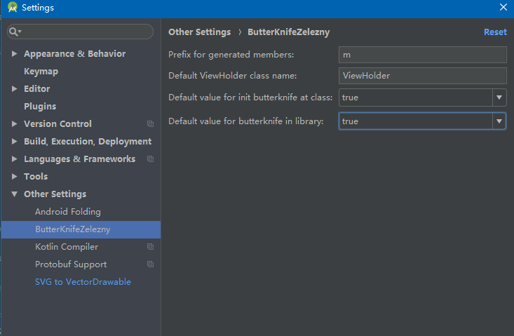

# Android-ButterKnife-Plugin-Plus

1. 增加ButterKnife in Library选项

# 介绍

包含[**android-butterknife-zelezny**](https://github.com/avast/android-butterknife-zelezny) 1.6版本所有功能，并在此基础上新增如下功能：

1. 可选择开始ButterKnife是否在Android Library中使用，替换生成R.id.*为R2.id.*，避免每次都手动修改的麻烦

2. 可自由选择是否在当前类中对ButterKnife进行初始化，避免了原版本只要使用插件初始化控件会自动在onCreate中进行ButterKnife.bind(this)的尴尬。

   

3. 在Android Studio设置界面，对在当前类中是否强制初始化提供了默认值设置。

   

# 如何使用

直接下载[Android-ButterKnife-Plugin-Plus.jar](https://raw.githubusercontent.com/OriginalLove/Android-ButterKnife-Plugin-Plus/master/Android-ButterKnife-Plugin-Plus.jar)，下载好后在AS中按照如下：Preferences->Plugins->Install plugin from disk 然后选择刚才下载的jar安装即可。

# 鸣谢

* [**@**Tomas Kypta](https://github.com/avast/android-butterknife-zelezny) 
* [@JakeWharton](https://github.com/JakeWharton/butterknife)

